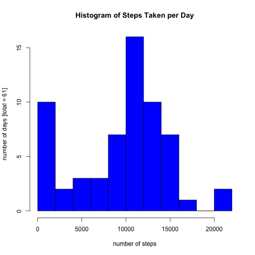
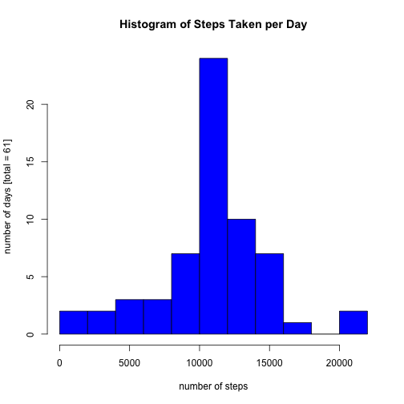

## Notes

Hello, and welcome to my assignment. I have included the assignment directions in *italic* type. I do not have the time I would like to polish this assignment - in particular, I would like to figure out how to convert the interval variable to a time format, and to do the last section correctly and with a panel plot as in the example. Tips on these topics or anything else would be very appreciated. Thank you for reading!

## Loading and preprocessing the data

*Show any code that is needed to*  
*1. Load the data (i.e. read.csv())*  
*2. Process/transform the data (if necessary) into a format suitable for your analysis*  

Unzip and load the data (this code assumes that the activity.zip file, included in this repository, is in the current directory). The resulting "csvData" contains three variables: steps, date, and interval. 

```r
unzip('activity.zip')
csvData <- read.csv("activity.csv")
```
Convert the date variable into Date format:

```r
csvData$date <- as.Date(csvData$date)
```

## What is mean total number of steps taken per day?

*For this part of the assignment, you can ignore the missing values in the dataset.*  
*1. Make a histogram of the total number of steps taken each day*  
*2. Calculate and report the mean and median total number of steps taken per day*  

Calculate the total number of steps taken per day using tapply:

```r
stepsbyday <- tapply(csvData$steps,csvData$date,sum,na.rm = TRUE)
```

Create a histogram:

```r
ndays <- length(unique(csvData$date))
ylabel <- sprintf("number of days [total = %d]", ndays)
hist(stepsbyday, 
     breaks = 10,
     col = "blue",
     main = "Histogram of Steps Taken per Day",
     xlab = "number of steps",
     ylab = ylabel)
```

 

The **mean** total number of steps taken per day is:

```r
print(mean(stepsbyday))
```

```
## [1] 9354.23
```
The **median** total number of steps taken per day is:

```r
print(median(stepsbyday))
```

```
## [1] 10395
```

## What is the average daily activity pattern?

*1. Make a time series plot (i.e. type = "l") of the 5-minute interval (x-axis) and the average number of steps taken, averaged across all days (y-axis)*  
*2. Which 5-minute interval, on average across all the days in the dataset, contains the maximum number of steps?*  

Calculate the average daily activity pattern using tapply:

```r
stepsbytime <- tapply(csvData$steps,csvData$interval,mean,na.rm = TRUE)
intervals <- unique(csvData$interval)
```

Plot the average daily activity pattern:

```r
plot(x = intervals,
     y = stepsbytime,
     type = 'l',
     main = "Average Daily Activity Pattern",
     xlab = "five-minute interval",
     ylab = "average number of steps")
```

 


The 5-minute interval in the average daily activity pattern that contains the maximum number of steps is: 

```r
print(intervals[which.max(stepsbytime)])
```

```
## [1] 835
```

## Imputing missing values

*Note that there are a number of days/intervals where there are missing values (coded as NA). The presence of missing days may introduce bias into some calculations or summaries of the data.*  
*1. Calculate and report the total number of missing values in the dataset (i.e. the total number of rows with NAs)*  
*2. Devise a strategy for filling in all of the missing values in the dataset. The strategy does not need to be sophisticated. For example, you could use the mean/median for that day, or the mean for that 5-minute interval, etc.*  
*3. Create a new dataset that is equal to the original dataset but with the missing data filled in.*  
*4. Make a histogram of the total number of steps taken each day and Calculate and report the mean and median total number of steps taken per day. Do these values differ from the estimates from the first part of the assignment? What is the impact of imputing missing data on the estimates of the total daily number of steps?*  

The total number of missing values in the dataset is:

```r
indexNAs <- is.na(csvData$steps)
print(sum(indexNAs))
```

```
## [1] 2304
```
The total number of **days containing missing values** in the dataset is:

```r
print(length(unique(csvData$date[indexNAs])))
```

```
## [1] 8
```

Create a new dataset, newData, in which the missing values are replaced by the average daily activity pattern for their respective 5-minute interval. (note: The number of steps from the average daily activity pattern are rounded because a fractional number of steps doesn't really make sense.)

```r
newData <- csvData
replace_intervals <- csvData$interval[indexNAs]
replace_data <- round(stepsbytime[match(replace_intervals,intervals)])
newData$steps[indexNAs] <- replace_data
```

Recreate the histogram from the previous section using the new data set with imputed values: 

```r
stepsbyday2 <- tapply(newData$steps,csvData$date,sum,na.rm = TRUE)
hist(stepsbyday2, 
     breaks = 10,
     col = "blue",
     main = "Histogram of Steps Taken per Day",
     xlab = "number of steps",
     ylab = ylabel)
```

 

The **mean** total number of steps taken per day in the filled-in data set:

```r
print(mean(stepsbyday2))
```

```
## [1] 10765.64
```
The **median** total number of steps taken per day in the filled-in data set:

```r
print(median(stepsbyday2))
```

```
## [1] 10762
```
These numbers are higher than those in the first part of the assignment because the days that contained missing values and previously had few or no steps recorded now have around the average number of steps. Both the mean and the median are higher than before, and the mean is close to the median, reflecting the fact that the number of steps is now more uniformly distributed across the 61 days.

## Are there differences in activity patterns between weekdays and weekends?

*For this part the weekdays() function may be of some help here. Use the dataset with the filled-in missing values for this part.*  
*1. Create a new factor variable in the dataset with two levels – “weekday” and “weekend” indicating whether a given date is a weekday or weekend day.*  
*2. Make a panel plot containing a time series plot (i.e. type = "l") of the 5-minute interval (x-axis) and the average number of steps taken, averaged across all weekday days or weekend days (y-axis). See the README file in the GitHub repository to see an example of what this plot should look like using simulated data.*  

Create a factor variable, daytype, indicating whether a data point occurred during the week or on a weekend:

```r
newData$daytype <- vector(length = length(newData$steps))
week_days <- weekdays(newData$date) %in% 
       c("Monday","Tuesday","Wednesday","Thursday","Friday")
newData$daytype[week_days] <- "weekday"
week_ends <- weekdays(newData$date) %in% c("Saturday","Sunday")
newData$daytype[week_ends] <- "weekend"
newData$daytype <- as.factor(newData$daytype)
```

Create a panel plot showing the average number of steps taken on weekdays and weekends:

```r
averages <- tapply(newData$steps, list(newData$interval,newData$daytype), mean)
par(mfrow = c(2,1))
par(mar = c(5,4,3,2))
plot(x = intervals,
     y = averages[,1],
     type = "l",
     main = "Average Weekday/Weekend Activity Patterns",
     xlab = "",
     ylab = "weekdays",
     ylim = c(0,250))
plot(x = intervals,
     y = averages[,2],
     type = "l",
     main = "",
     xlab = "five-minute interval",
     ylab = "weekends",
     ylim = c(0,250))
```

 

It looks like the user tends to sleep later on weekends (there is not the sharp increase in steps just after 5 am as on weekdays) and stay up later (steps do not drop off until after 8 pm).
